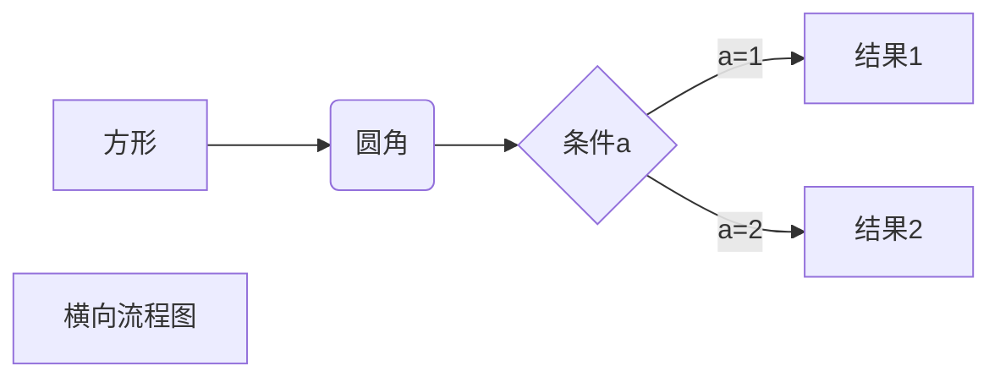

# Hello

这里是测试

## 一、MarkDown语法

### 1.句首添加点点
* 在句首加*和空格

### 2.换行
* 测试换行  
* 使用两个空格即可换行  

### 3.文本
* *斜体文本* 或 _斜体文本_
* **粗体文本** 或 __粗体文本_
* ***粗斜体文本*** 或 ___粗斜体文本___

### 4.分割线
* 三个以上*或-或_行内不能有其他东西 可以有空格
--   --
***  *
_____ ____

### 5.删除线
* Hello
* ~~Hello~~

### 6.下划线
* 可以通过HTMl中的 \<u> 实现
* <u>带下划线</u>  

### 7.脚注（注释）

* 创建脚注[^hello]
[^hello]:脚注在这里

### 8.列表
* 列表1
+ 列表2
- 列表3
1. 有序号的列表
2. 第二项
3. 第三项  

1. 第一项
    - 嵌套
    - 2  

### 9.区块
> 区块饮用  
> a  
> b  

* 嵌套
> a  
> > b  
> >
> > > c  

* 实用列表
> 1. 第一项
> 2. 第二项
> + a
> + b
> - c

* 或
* 第一项
    > a
    > b
* 第二项

### 10.代码

* 用两个`包裹的区域  
* `printf()`
* 用三个`包裹一段代码并指定一种语言（也可以不指定）  
```java
System.out.println("Hello,MarkDown!)
```

### 11.链接
* `[链接名称](链接地址)` 或 `<链接地址>`  
* 这是一个链接[百度](https://www.baidu.com)  
* <https://www.baidu.com>
> 高级链接  
> **通过一个变量设置**  
> 百度[baidu][baidu]  

[baidu]:http://www.baidu.com/

### 12.图片

``  或 `` 


### 13.表格
* 语法
  ` | 表头 | 表头 |  
  | --- | --- |  
  |单元格|单元格|  
  |单元格|单元格|  `  
  
* 实现  
  | 表头 | 表头 |  
  | --- | --- |  
  |单元格|单元格|  
  |单元格|单元格| 
  
* 对齐方式
`:---- 设置内容和标题栏居右对齐  
 ----: 设置内容和标题栏居左对齐
 :----:设置内容和标题栏居中对齐 `

* 实现  
  | 表头 | 表头 | 表头 |
  |:----|:----:|----:|
  |单元格abcada| 单元格| dafafava |
  |单元格| 单元格|dada|
  
### 14.高级技巧 网址[RUNBOON.COM](https://www.runoob.com/markdown/md-advance.html)

> 1. 支持HTML元素 `<kbd> <b> <i> <em> <sup> <sub> <br> 等`
> * 使用<kbd>CTRL</kbd>+<kbd>ALT</kbd>+<kbd>DEL</kbd>重启电脑
> ```
> \   反斜线
> `   反引号
> *   星号
> _   下划线
> {}  花括号
> []  方括号
> ()  小括号
> #   井字号
> +   加号
> -   减号
> .   英文句点
> !   感叹号
> ```

> 2. 支持公式  
> * 当你需要在编辑器中插入数学公式时，可以使用两个美元符 $$ 包裹 TeX 或 LaTeX 格式的数学公式来实现。提交后，问答和文章页会根据需要加载 Mathjax 对数学公式进行渲染。  
> ```
> $$
> \mathbf{V}_1 \times \mathbf{V}_2 =  \begin{vmatrix} 
> \mathbf{i} & \mathbf{j} & \mathbf{k} \\
> \frac{\partial X}{\partial u} &  \frac{\partial Y}{\partial u} & 0 \\
> \frac{\partial X}{\partial v} &  \frac{\partial Y}{\partial v} & 0 \\
> \end{vmatrix}
> ${$tep1}{\style{visibility:hidden}{(x+1)(x+1)}}
> $$
> ```

$$
\mathbf{V}_1 \times \mathbf{V}_2 =  \begin{vmatrix}  
\mathbf{i} & \mathbf{j} & \mathbf{k} \\  
\frac{\partial X}{\partial u} &  \frac{\partial Y}{\partial u} & 0 \\  
\frac{\partial X}{\partial v} &  \frac{\partial Y}{\partial v} & 0 \\  
\end{vmatrix}  
${$tep1}{\style{visibility:hidden}{(x+1)(x+1)}}
$$

### 14.支持流程图



##### eg
```flow
st=>start: 开始框
op=>operation: 处理框
cond=>condition: 判断框(是或否?)
sub1=>subroutine: 子流程
io=>inputoutput: 输入输出框
e=>end: 结束框
st->op->cond
cond(yes)->io->e
cond(no)->sub1(right)->op
```

