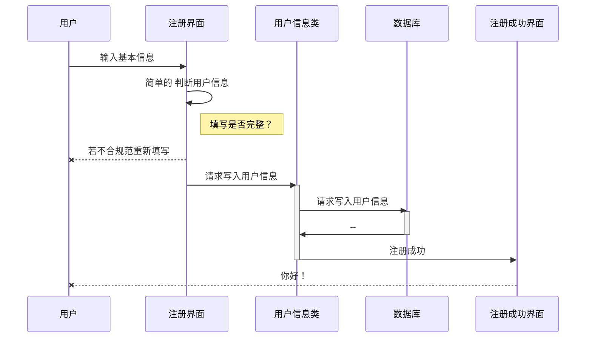
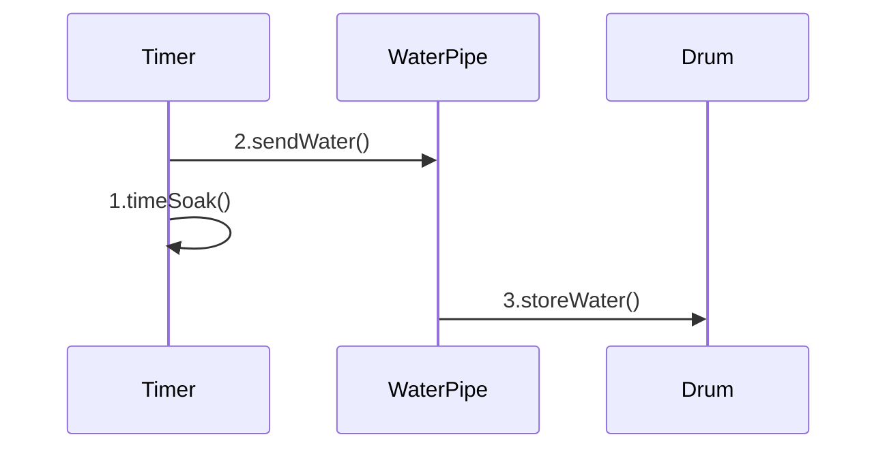

# UML系统分析与设计

## 一、UML简介

### 1.1 什么是UML
* 系统是软件和硬件的组合，该组合为业务问题提供解决方案
* Unified Modeling Language 统一建模语言
* 特点：可视化的建模语言
* 功能：
  * 1. 让使用者用标准的、易于理解的方式构建系统蓝图；
  * 2. 提供一种机制，使不同人之间有效地共享和交流设计结果
* UML可以描述硬件之间的关系，也可以描述硬件单元上的软件系统的分布。
* 面向对象方法认为系统是由应用域的对象组成的
* 硬件(物理)系统体系结构要对系统的构件、结点的配置进行描述。
* 硬件(逻辑)系统体系结构对系统的用例、类、对象、按口以及相互间的交互和协作进行描述。
* 
### 1.2 UML简史
* UML是由信息系统和面向对象领域的三位著名的方法学家Grady Booch 、James Rumbaugh和Ivar Jacobson在20世纪90年代中期提出的。

### 1.3 UML组成

>1、用例图：从用户角度描述系统功能，并指出各功能的操作者。
>
>2、静态图：是UML中从系统静态角度来描述的系统。
>
>          包括类图和对象图。
>            
>          类图：描述系统中类的静态结构，不仅定义系统中的类，表示类之间的联系，如关联、依赖、聚合等，也包括类的属性和操作，类图描述的是一种静态关系，在系统的整个生命周期都是有效的。
>            
>          对象图：是类图的实例，几乎使用与类图完全相同的标识。一个对象图是类图的一个实例。由于对象存在生命周期，因此对象图只能在系统某一时间段存在。
>
>3、行为图：描述系统的动态模型和组成对象间的交互关系。
>
>          包括状态图和活动图。
>            
>          状态图：描述类的对象所有可能的状态以及事件发生时状态的转移条件，状态图是对类图的补充。
>            
>          活动图：描述满足用例要求所要进行的活动以及活动间的约束关系，有利于识别并进行活动。
>
>4、交互图：描述对象间的交互关系，一个交互就是指在特定语境中，为了实现某一个目标，而在一组对象之间进行交换的一组消息所表示的行为。
>
>          包括时序图和协作图。
>            
>          时序图：显示对象之间的动态合作关系，它强调对象之间消息发送的顺序，同时显示对象之间的交互。
>            
>          协作图：描述对象间的协作关系，协作图跟时序图相似，显示对象间的动态合作关系。除显示信息交换外，协作图还显示对象以及它们之间的关系。如果强调时间和顺序，则使用时序图；如果强调上下级关系，则选择协作图。
>
>5、实现图：实现图是描述现实方面的信息，它从系统的层次来描述硬件的组成和布局以及软件系统划分和功能实现。
>
>          包括组件图和部署图。
>            
>          组件图：描述代码部件的物理结构及各部件之间的依赖关系，组件图有助于分析和理解部件之间的相互影响程度。
>            
>          部署图：定义系统中软硬件的物理体系结构。

* UML提供图的目的是用多个视图来展示一个**系统**，这组视图被称为一个**模型**。
* UML中被合称为交互图的是**顺序图**和**协作图**。
* 当创建模型需要包含新的概念和符号时，需要使用**构造型**实现。

#### 1.3.1 类图

* 一个类是一类或者一组具有相似属性和共同行为的事物
> |  类名 WashingMachine   |
> | :--------------------: |
> |    属姓名 brandName    |
> | 操作名 acceptClothes() |
>
> * 类名、属姓名、操作名之间有间隔
> * 单词之间没有空格
> * 每个单词的首字母大写 -> 类名
> * 第一个单词的首字母小写 -> 操作名、属姓名

#### 1.3.2 对象图

* 对象是一个类的实例，是具有具体属性值的一个具体事物
* <kbd><u>*myWasher:WashingMachine*</u></kbd> 具体对象
* <kbd><u>:WashingMachine</u></kbd> 匿名对象

#### 1.3.3 用例图

* 用例是用户的观点对系统行为对一个描述。
* 参与者—系统-用例


#### 1.3.4 状态图

* 一个对象总是位于某一个特定对状态，不同状态之间可以相互转换

  ```mermaid
  stateDiagram-v2
  [*] --> 侵泡
  侵泡 --> 洗涤
  洗涤 --> 漂洗
  漂洗 --> 脱水
  脱水 --> [*]
  ```

#### 1.3.5 顺序图

* 类图和对象图表达是系统的静态结构。一个运行的系统中，对象之间要发生交互，并且这些交互要经历一定的时间。-》UML顺序图



#### 1.3.6 活动图

* 某一步到某一步的时间顺序

#### 1.3.7 协作图

* 系统的工作目标是由系统中各组成元素相互协作完成的，建模语言必须具备这种协作关系的表达方式。



#### 1.3.8 构件图


#### 1.3.9 部署图


### 1.4其他特征

#### 1.4.1 注释

* 注释图标：带折角的矩形

* 虚线：连接注释和被注视的图元素

* 任何图元素都可以被附加注释

  

#### 1.4.2 关键字和构造型

* 构造型是在现有的元素上添加一个带双尖括号的关键字
* 该关键字表明新元素的用法与其原来的意图不同
